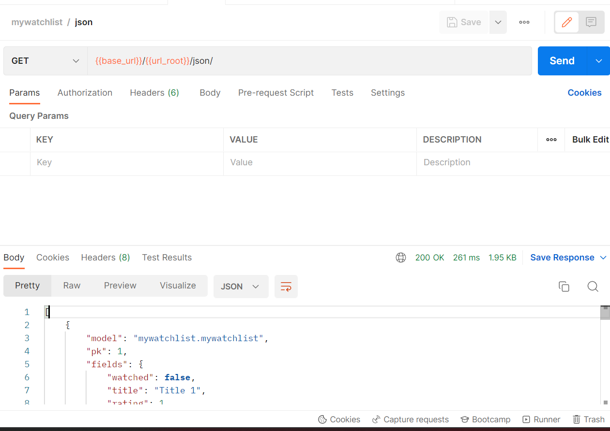
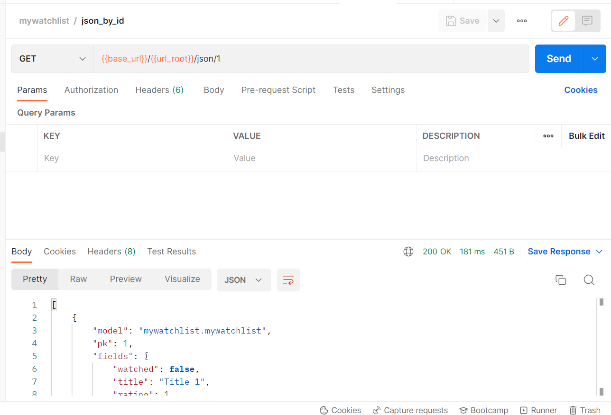
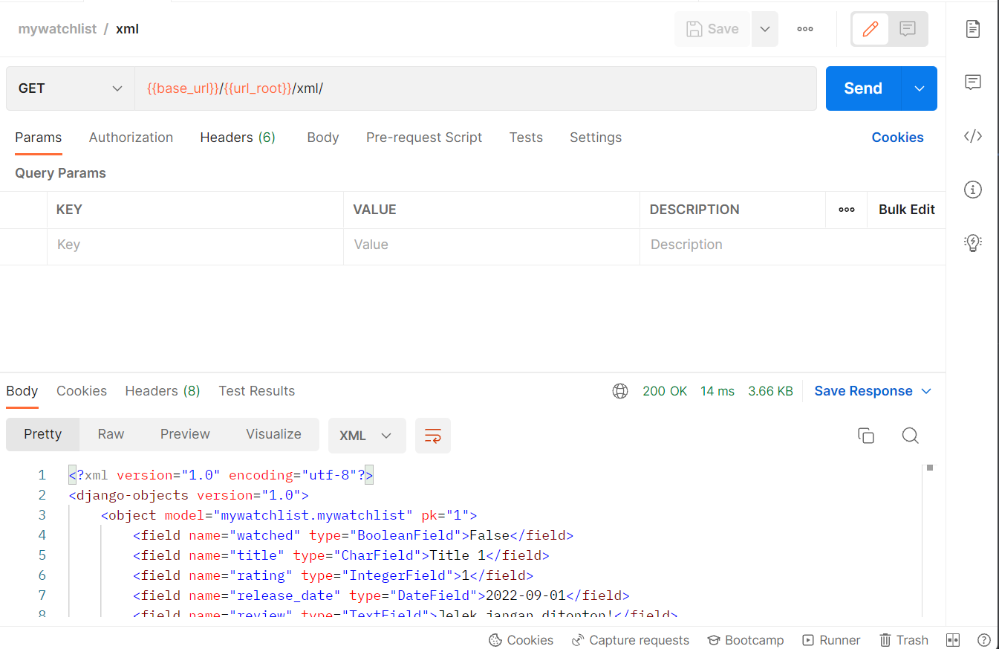
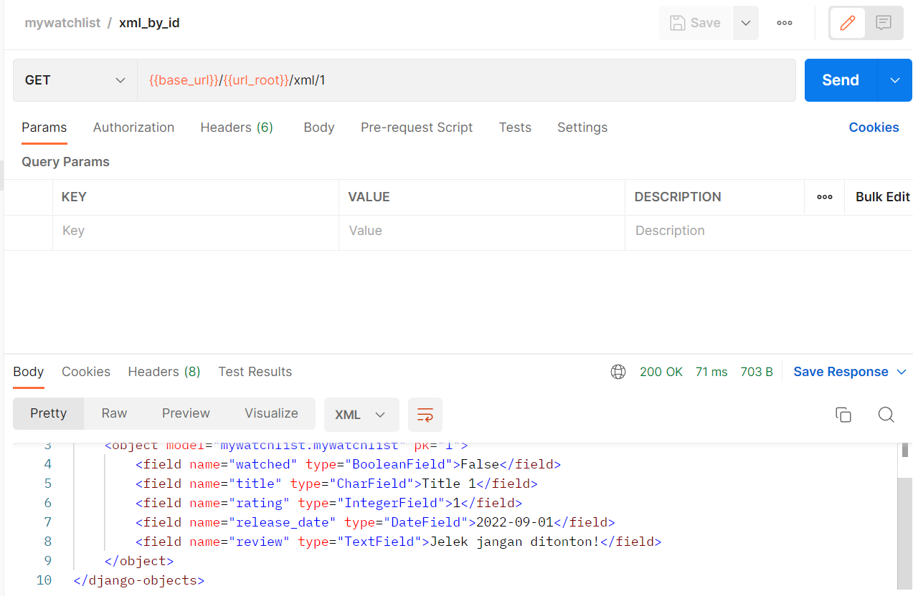
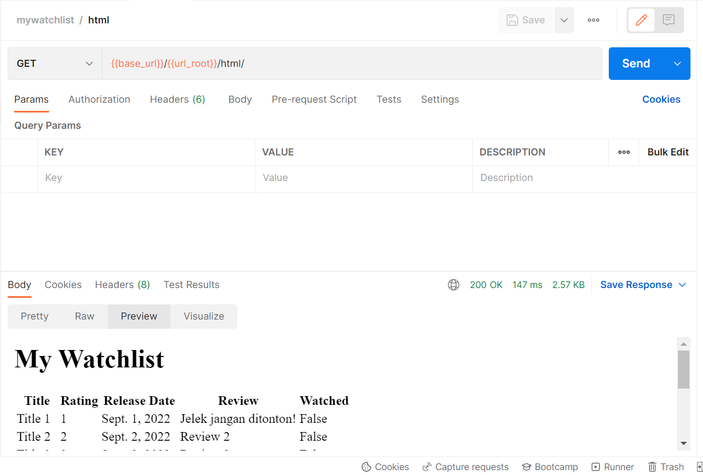

# Tugas 3

## Link
Heroku <https://naufalweise-pbp-tugas-02.herokuapp.com/mywatchlist/>

## JSON vs XML vs HTML
Javascript Object Notation (JSON)
- Untuk menyimpan data, biasanya tidak langsung ditampilkan ke user.
- memiliki syntax yang mirip dengan objek javascript
- data disajikan dalam bentuk pasangan key value, dipisahkan oleh koma. Objek ditandai oleh kurung kurawal. Array ditandai oleh kurung siku.
```json
{
    "movie_title": "Movie ABC",
    "casts": ["Actress A", "Actor B"],
}
```
- dapat di konvert ke objek javascript dengan cepat
- memiliki size yang relatif kecil

eXtensible Markup Language (XML)
- Untuk menyimpan data, biasanya tidak langsung ditampilkan ke user.
- Syntax
    - menggunakan tag pembuka dan penutup untuk merepresentasikan data
    - Tag case sensitive
    - Nama tag bebas
    - Tidak truncate whitespace.
```xml
<movie>
    <movie_title>Movie ABC</movie_title>
    <casts>
        <cast>Actress A</cast>
        <cast>Actor B</cast>
    </casts>
</movie>
```
- lebih lambat untuk dikonvert ke objek javascript
- memiliki size yang relatif lebih besar
- Akses menggunakan XML DOM dengan struktur node-tree.

Hyper Text Markup Language (HTML)
- Dokumen yang akan ditampilkan ke user.
- Syntax
    - menggunakan tag pembuka
    - Tag penutup tidak selalu wajib
    - Tag case-insensitive
    - Nama tag sudah predefined
    - Truncate white-space.
- Akses menggunakan HTML DOM dengan struktur node-tree.

## Mengapa kita memerlukan data delivery dalam pengimplementasian sebuah platform?
Komunikasi antara server dan client melibatkan pengiriman data dari kedua belah pihak.
Misal dalam konteks aplikasi web, client mengirim request yang dijawab server dengan data.
Data yang dikirim bisa dalam bentuk halaman web HTML atau yang lebih sederhana seperti json dan xml.
Tanpa data delivery tak ada komunikasi data antar server dan client.

## Cara implementasi tugas
- Buatlah app mywatchlist dengan mengetik dishell:
```
django-adming startapp mywatchlist
``` 
- Include app tersebut di setting
- Buatlah model MyWatchList pada app tersebut. Sesuaikan jenis field dengan data yang akan di simpan.
- Jalankan makemigrations & migrate
- Buatlah data awal dengan menambahkan json di fixture app ini.
- Buatlah [script](../migrate.sh) untuk migrate & load data fixtures. Jalankan script ini di lokal.
- Di Procfile, panggil script migrate tiap release.
- Buatlah views untuk json, xml, html.
- Editlah urls.py pada app untuk routing json, xml, html.
- Include urls app pada urls.py project.
- Commit & Push

## Screenshots Postman





